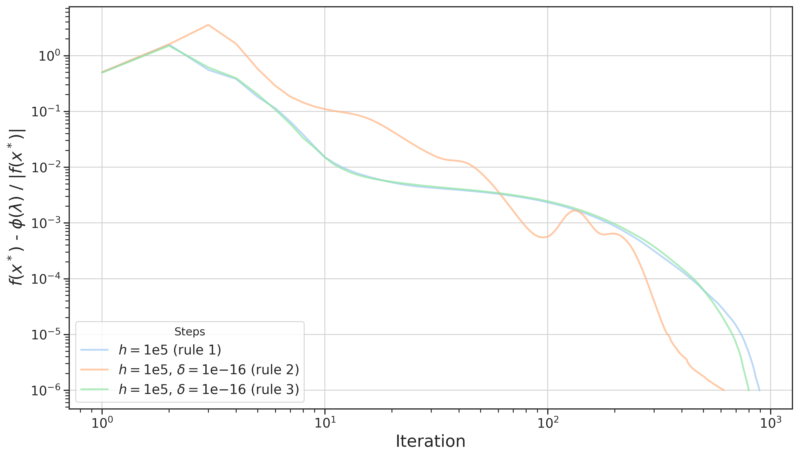
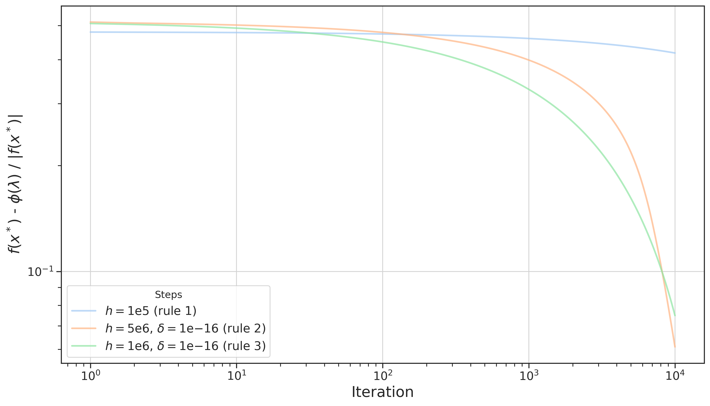

# Quadratic disjoint simplices

Solution quadratic problem with disjoint simplices constraints.

## Problem formulation

This package aims to solve the following quadratic problem


subject to disjoint simplices constraints. 
The problem is tackled by solving the dual problem


by using different iterative methods based on the standard subgradient method. In particular, we iteratively compute


and then update  based on three different subgradient rules derived from the following [paper](https://jmlr.org/papers/volume12/duchi11a/duchi11a.pdf)


where  is the projection over the non-negative orthant with \
  \
 is the subgradient \
 \
is the full outer product of the subgradient \
 is an approximation of the hessian \
 is the average of the subgradient until  and finally \
 is the chosen stepsize. \
To check the derived rules and the theoretical analysis, check [report](report/report.pdf)


## Execution

The code is entirely contained in a single script, to reduce allocation and execution time of Julia. 
To test the code, clone this repository, open your Julia REPL and run 
```
    ]
```
to enter in pkg mode
```
    instantiate
```
to download modules declared in [Manifest.toml](Manifest.toml). Then
```
    include(src/main.jl)
```
to compile the code in the REPL.
```
    initialize(params)
```
will execute the program, asking for the problem dimension  and the number of disjoint simplices .\
params are the following:
- stepsize: the stepsize  that you want to adopt;
- rule: one among the three update rules for  described above;  
- : hyperparameter for stepsize 2 and 3;
- : hyperparameter for stepsize 2 and 3;
- : hyperparameter for rule 2 and 3;
- h: hyperparameter for stepsize 0 and 1;
- max_iter: maximum iterations;


## Results

Below are two examples of results obtained with _constant length_ and _constant step_ stepsizes, using the different update rules of  on a problem of size  5000 and number of constraints  2500

 
